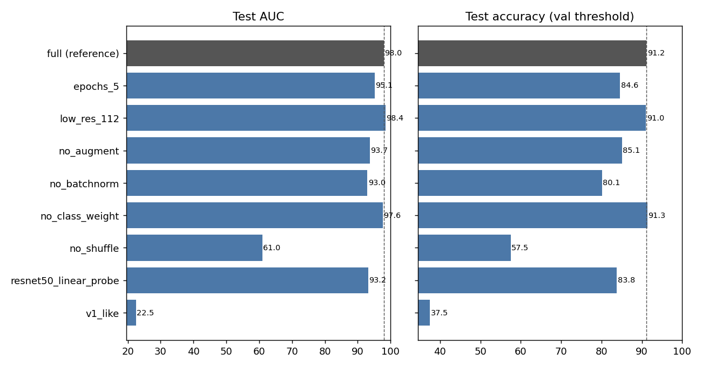
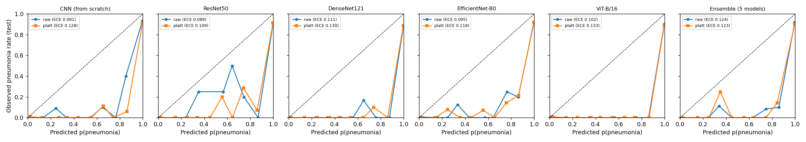
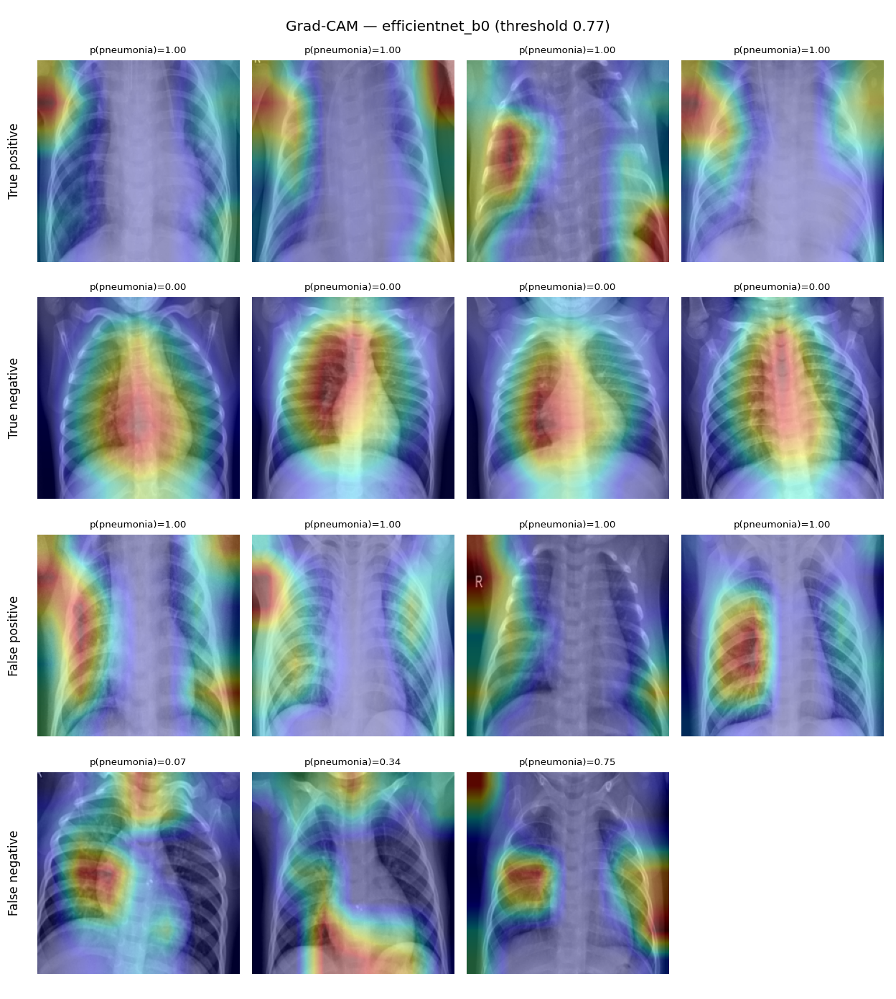

# 胸部 X 光肺炎二分类 (Pneumonia Chest X-Ray Classification)

[](https://github.com/weirdquantum/pneumonia-xray-classification/actions/workflows/tests.yml) [](LICENSE) [](https://colab.research.google.com/github/weirdquantum/pneumonia-xray-classification/blob/main/colab/run_all_experiments.ipynb)

基于儿童胸部 X 光片区分 **NORMAL（正常）** 与 **PNEUMONIA（肺炎）**，2025 年暑期科研项目。用统一的 PyTorch 流程比较从零训练的 CNN 与 4 个 ImageNet 预训练模型（ResNet50 / DenseNet121 / EfficientNet-B0 / ViT-B/16）：按患者划分验证集，每个模型训练 3 个随机种子，并做消融实验、概率校准、模型集成和 Grad-CAM 捷径检查。

**结果（3 个种子的均值 ± 标准差，官方测试集 624 张）：** 5 模型集成 ROC-AUC **98.7 ± 0.1**；单模型准确率 88–92%（ResNet50 最高，**92.0 ± 1.3%**），敏感度约 99%（几乎不漏诊），特异度 69–80%。

同时也发现了几个限制：验证集与测试集之间存在分布偏移；部分模型会利用心电电极、导管和方位标记等"捷径"；各模型之间的差异大多在随机种子的波动范围内。详见[主要发现](#主要发现)。


## 结果

每个模型在训练结束后只在测试集上评估一次；checkpoint 和决策阈值（Youden 指数）都在验证集上选取。数值均为百分比（AUC × 100）。

### 主实验：3 个随机种子的均值 ± 标准差

每个种子会重新按患者划分验证集，测试集固定不变。

| Model | Seeds | AUC | Accuracy | Sensitivity | Specificity | F1 | Threshold | Train (min) |
|---|---|---|---|---|---|---|---|---|
| CNN (from scratch) | 3 | 97.9 ± 0.4 | 88.2 ± 3.2 | 99.6 ± 0.1 | 69.2 ± 8.8 | 91.4 ± 2.1 | 0.31 ± 0.14 | 2 |
| ResNet50 | 3 | 98.0 ± 0.5 | 92.0 ± 1.3 | 99.2 ± 0.5 | 79.9 ± 3.9 | 93.9 ± 0.9 | 0.75 ± 0.22 | 1 |
| DenseNet121 | 3 | 98.4 ± 0.4 | 89.3 ± 2.3 | 99.7 ± 0.3 | 71.8 ± 6.2 | 92.1 ± 1.5 | 0.75 ± 0.16 | 2 |
| EfficientNet-B0 | 3 | 98.4 ± 0.4 | 91.7 ± 1.5 | 99.1 ± 0.3 | 79.3 ± 4.4 | 93.7 ± 1.1 | 0.60 ± 0.16 | 2 |
| ViT-B/16 | 3 | 98.5 ± 0.1 | 91.0 ± 0.6 | 99.7 ± 0.0 | 76.4 ± 1.7 | 93.2 ± 0.5 | 0.69 ± 0.09 | 1 |
| Ensemble (5 models) | 3 | 98.7 ± 0.1 | 91.9 ± 2.0 | 99.2 ± 0.4 | 79.6 ± 5.8 | 93.9 ± 1.4 | 0.77 ± 0.09 | 8 |

训练时间是在 Colab A100（混合精度）上测得的，23 次训练合计 36 分钟。

### 种子 42：单次运行与 95% 置信区间

括号内为按患者重采样 1000 次的 bootstrap 95% 置信区间。

| Model | Params (M) | AUC | Accuracy | Sensitivity | Specificity | F1 | Acc @0.5 | Threshold | CAM border share |
|---|---|---|---|---|---|---|---|---|---|
| CNN (from scratch) | 1.2 | 98.0 (96.9–98.9) | 91.2 (88.6–93.6) | 99.5 (98.6–100.0) | 77.4 (71.4–83.0) | 93.4 (91.1–95.3) | 91.3 | 0.47 | 0.26 |
| ResNet50 | 23.5 | 97.5 (95.8–98.7) | 90.7 (88.0–93.0) | 99.7 (99.2–100.0) | 75.6 (69.6–81.0) | 93.1 (90.7–94.9) | 90.7 | 0.50 | 0.36 |
| DenseNet121 | 7.0 | 98.4 (97.3–99.2) | 89.6 (86.8–91.9) | 100.0 (100.0–100.0) | 72.2 (66.0–77.4) | 92.3 (89.9–94.1) | 88.9 | 0.59 | 0.29 |
| EfficientNet-B0 | 4.0 | 98.8 (97.9–99.4) | 92.5 (90.0–94.6) | 99.2 (98.3–100.0) | 81.2 (75.6–86.2) | 94.3 (92.2–96.0) | 91.2 | 0.77 | 0.45 |
| ViT-B/16 | 85.8 | 98.4 (97.4–99.2) | 90.9 (88.2–93.2) | 99.7 (99.2–100.0) | 76.1 (70.0–81.7) | 93.2 (90.9–95.1) | 89.9 | 0.62 | 0.33 |
| Ensemble (5 models) | 121.4 | 98.8 (97.8–99.5) | 92.8 (90.5–94.8) | 99.5 (98.6–100.0) | 81.6 (76.2–86.5) | 94.5 (92.6–96.1) | 87.8 | 0.81 | – |

- **Acc @0.5**：阈值固定为 0.5 时的准确率。
- **CAM border share**：Grad-CAM 热力图落在图像外围 12.5% 边框内的比例，均匀分布时为 0.44。这个平均值会掩盖问题，见发现 4。


### 消融实验

在从零训练的 CNN 上每次只改动一项，其余与参考配置相同（种子 42）。另外加了一个只训练分类头的 ResNet50 线性探针，对应 v1 的"冻结特征"做法。

| Variant | Description | AUC | Accuracy | Sensitivity | Specificity | Acc @0.5 | Δ AUC | Δ Accuracy |
|---|---|---|---|---|---|---|---|---|
| full (reference) | v2 CNN: shuffle, augment, class weight, BatchNorm, 224px, 30 epochs | 98.0 | 91.2 | 99.5 | 77.4 | 91.3 | – | – |
| no_shuffle | 训练数据按类别排序、不打乱（v1 的 bug） | 61.0 | 57.5 | 57.2 | 58.1 | 62.5 | -37.0 | -33.7 |
| no_batchnorm | 去掉 BatchNorm | 93.0 | 80.1 | 99.0 | 48.7 | 83.7 | -5.1 | -11.1 |
| no_augment | 不做数据增强 | 93.7 | 85.1 | 98.5 | 62.8 | 81.9 | -4.3 | -6.1 |
| epochs_5 | 只训练 5 轮 | 95.1 | 84.6 | 99.5 | 59.8 | 88.8 | -2.9 | -6.6 |
| no_class_weight | 不做类别加权 | 97.6 | 91.3 | 99.7 | 77.4 | 83.5 | -0.5 | +0.2 |
| low_res_112 | 输入分辨率 112×112 | 98.4 | 91.0 | 99.2 | 77.4 | 90.4 | +0.4 | -0.2 |
| resnet50_linear_probe | ResNet50 冻结 ImageNet 特征，只训练分类头 | 93.2 | 83.8 | 92.8 | 68.8 | 79.5 | -4.8 | -7.4 |
| v1_like | v1 配方：v1 网络、100px、无增强/加权/打乱、5 轮、batch 10 | 22.5 | 37.5 | 0.0 | 100.0 | 62.5 | -75.5 | -53.7 |



### 版本演进

| 方法 | v1（Keras / sklearn） | v2（单次运行） | v3（3 种子均值 ± 标准差） |
|---|---|---|---|
| CNN（从零训练） | 78.0% | 89.1% | 88.2 ± 3.2% |
| ResNet50 | 80.8%（冻结特征 + 逻辑回归） | 93.3% | 92.0 ± 1.3% |
| ViT | 75.3%（只用了 ViT 预处理器 + 像素逻辑回归） | 91.0% | 91.0 ± 0.6% |
| DenseNet121 | – | 88.3% | 89.3 ± 2.3% |
| EfficientNet-B0 | – | 91.5% | 91.7 ± 1.5% |
| 5 模型集成 | – | – | 91.9 ± 2.0%（AUC 98.7 ± 0.1） |

## 主要发现

1. **模型之间的差异大多在随机种子的波动范围内。** 单模型 AUC 为 97.9–98.5，标准差 0.1–0.5；准确率的种子间标准差最高 3.2 个百分点，特异度最高 8.8 个百分点。集成的 AUC 最高也最稳定（98.7 ± 0.1），但准确率（91.9 ± 2.0%）并不比单个 ResNet50 高，因为准确率主要受阈值限制，而不是排序能力。v2 中 ResNet50 单次运行的 93.3% 处在它波动范围的高端：3 个种子平均是 92.0%，种子 42 只有 90.7%。只报告单次运行会高估结果。

2. **消融实验：哪些改动真正起作用。** 消融只跑了一个种子，而 CNN 的种子间标准差为 AUC 0.4、准确率 3.2，所以 AUC 差距小于约 1 个点、准确率差距小于约 3–6 个点的结果不能区分。
   - **打乱训练数据是决定性的。** 按类别排序喂数据时，CNN 退化成近似常数的输出（所有图片的预测概率都在 0.70–0.80 之间），测试 AUC 只有 61.0。
   - **BatchNorm（−5.1 AUC）、数据增强（−4.3）和足够的训练轮数（−2.9）** 都有明显贡献。
   - **分辨率（112 vs 224）没有可检测的影响。类别加权在调过阈值后也没有影响**；它只在固定 0.5 阈值时起作用（准确率 91.3% vs 83.5%）。
   - **微调远好于冻结特征。** ResNet50 线性探针的 AUC 为 93.2，微调为 98.0 ± 0.5。v1 用冻结 ResNet 特征加逻辑回归，这一做法本身就限制了上限。
   - **v1 配方没能复现 v1 的 78%。** 复现版同样退化成常数输出（概率都在 0.66–0.68 之间），所以 AUC 22.5 只是噪声，不代表"预测反了"。原版 v1 用的是 Keras 的 Adam 固定学习率、二分类 softmax、[0, 1] 输入并取最后一轮的模型；复现版用的是 OneCycle 学习率、AdamW、ImageNet 标准化并按验证 loss 选模型。在按类别排序训练这种不稳定的设置下，这些细节决定了模型会不会崩溃。两次运行都支持"不打乱数据有害"，但具体损失多少取决于实现细节。

3. **问题出在分布偏移，而不是模型"过度自信"（修正 v2 的说法）。** 所有模型在验证集上的校准误差（ECE）只有 0.01–0.02，也就是说，大量接近 0 或 1 的预测在同分布数据上是准确的。到了测试集，ECE 升到 0.08–0.13。在验证集上拟合的温度缩放几乎没有改变；Platt 缩放甚至让测试集 ECE 变差，因为它学到的偏移量 b > 0 会把概率推向"肺炎"，而测试集里的正常片本来就得分偏高。阈值在种子间的大幅波动（例如 ResNet50 为 0.75 ± 0.22）是同一问题的另一种表现。要可靠地校准概率和阈值，需要来自目标分布的数据。

   

4. **部分模型存在捷径学习（撤回 v2 的"没有发现捷径学习"）。** v2 只看了全部测试图片热力图边框占比的平均值，而正常片的热力图通常集中在心脏和纵隔，把平均值拉低、掩盖了问题。逐类查看种子 42 的热力图后发现：
   - **ResNet50** 对最有把握的肺炎预测，主要关注图像边缘的心电电极、导管、导线和角落；
   - **EfficientNet-B0** 对肺炎预测（包括误报）主要看左上角和 "R" 方位标记，边框占比 0.45，高于均匀分布的 0.44；
   - **ViT-B/16** 的热力图分布在双侧肺野，**DenseNet121** 和 **CNN** 基本集中在胸腔内。

   一个合理的解释是：肺炎患儿更可能是住院患者，身上带着监护设备，这些设备就成了与标签相关的混杂因素。同一模型在不同训练中的表现也不一样（EfficientNet 在 v2 那次训练中边框占比为 0.33），所以每个训练好的模型都需要单独检查。

| ResNet50：关注电极与边缘 | EfficientNet-B0：关注角落与 "R" 标记 | ViT-B/16：关注肺野 |
|---|---|---|
|  |  |  |

每张图的四行依次为真阳性、真阴性、假阳性、假阴性中置信度最高的病例。DenseNet121 和 CNN 的热力图见 [`figures/`](figures/)。

## 数据

使用 Kaggle 公开数据集 [Chest X-Ray Images (Pneumonia)](https://www.kaggle.com/datasets/paultimothymooney/chest-xray-pneumonia)（Kermany et al., *Cell* 2018）。数据不在仓库中，下载后把 `train/`、`test/`（以及可选的 `val/`）放在项目根目录。

`scripts/prepare_data.py` 的处理：

- **按患者划分验证集。** 文件名中带有患者编号（`person123_bacteria_456.jpeg`、`IM-0115-0001.jpeg`），训练集 3875 张肺炎片只来自约 1600 名患者，最多一人 30 张。用 `StratifiedGroupKFold` 从训练集中按患者分出约 15% 作为验证集，保证同一患者不会同时出现在训练集和验证集，同时保持类别比例。官方 `val/` 只有 16 张，并入训练池。
- **统一读图。** 训练集中有 283 张 JPEG 是 RGB 三通道（v1 的 ViT notebook 正是因此静默丢掉了这些图），这里全部转为灰度后再缩放为 256×256，缓存为 `data/images.npy`。正常片与肺炎片的原始尺寸存在系统性差异（宽度中位数 1640 px vs 1168 px），统一缩放为正方形可以消除宽高比这一潜在捷径。
- **数据检查**（`data/data_report.json`）：训练集与验证集之间没有患者重叠；数据中有 32 张完全重复的图片，都在同一划分内部，没有跨划分重复。

默认划分（种子 42，本地环境）：

| 划分 | 正常 | 肺炎 | 患者数 |
|---|---|---|---|
| train | 1149 | 3321 | 2440 |
| val | 192 | 554 | 406 |
| test | 234 | 390 | 427 |

v3 的每个种子都会重新抽取训练/验证划分（训练加验证共 5216 张）。同一个种子在不同 scikit-learn 版本下可能得到不同的划分（例如 Colab 上种子 42 是 4494 / 722），所以每次运行实际使用的验证集图片都记录在各自的 `val_predictions.csv` 中。

## 方法

- **输入**：灰度图复制为 3 通道，224×224，ImageNet 均值方差标准化。
- **数据增强**（仅训练）：随机裁剪缩放（面积 70–100%）、±10° 旋转、±5% 平移、亮度/对比度扰动。不使用水平翻转，因为心脏位于左侧，翻转会产生解剖上不合理的图像。
- **类别不平衡**：`BCEWithLogitsLoss` 的 `pos_weight = 正常数 / 肺炎数`；可选 Focal Loss（`--loss focal`）。
- **两阶段微调**：先冻结主干网络（参数、BatchNorm 统计量和 dropout 全部固定），训练 2 轮新分类头（lr 1e-3）；再全部解冻，用 AdamW + OneCycle 学习率微调。梯度裁剪 1.0，CUDA 上使用混合精度。
- **模型选择**：按验证集上的 loss（由原始 logits 计算）选择 checkpoint 并早停。验证集 AUC 在 0.998 附近饱和，不适合用来挑选模型。测试集只在最后评估一次。
- **评估**：准确率、敏感度、特异度、精确率、F1、ROC-AUC、混淆矩阵；按患者 bootstrap 1000 次估计置信区间；3 个种子（42 / 43 / 44）报告均值 ± 标准差。
- **校准与集成**：在验证集 logits 上拟合温度缩放和 Platt 缩放，在测试集上计算 ECE（15 个分箱）、Brier 分数和 NLL。集成对 5 个模型 Platt 校准后的概率取平均，阈值同样在验证集上选取。
- **消融**：在 CNN 上每次只改一项（种子 42）。

## 复现

**Colab（推荐）**：打开上方的 Colab 徽章，在"代码执行程序 → 更改运行时类型"中选择 GPU，然后"全部运行"。结果会保存到 Google Drive，断线后重新运行会从断点继续。在 A100 上实测训练共 36 分钟（另需几分钟准备数据），T4 预计需要 3–4 小时。

**本地：**

```bash
python -m venv .venv && source .venv/bin/activate
pip install -e ".[dev]"
```

```bash
python scripts/prepare_data.py --raw . --out data
```

```bash
python scripts/experiments.py
```

`experiments.py` 依次运行主实验、消融实验、Grad-CAM、集成、校准和汇总报告，已完成的训练会自动跳过。加上 `--plan smoke` 可以在几分钟内跑通全流程，用来检查环境。单独训练一个模型：

```bash
python -m pneumonia.train --model resnet50 --seed 42 --split-seed 42 --out runs/main/resnet50/seed42
```

程序会自动选择 CUDA、Apple MPS 或 CPU。运行单元测试：

```bash
pytest
```

## 项目结构

```
src/pneumonia/
  data.py       文件名解析、按患者划分、图像缓存、Dataset 与数据增强
  models.py     模型注册表（含消融用的无 BatchNorm CNN 和 v1 复现网络）
  train.py      两阶段训练、按验证 loss 早停、验证集选阈值、测试集评估
  metrics.py    评估指标、Youden 阈值、按患者 bootstrap 置信区间
  gradcam.py    Grad-CAM（含 ViT token 重排）与边框占比统计
  calibrate.py  温度缩放 / Platt 缩放、ECE、可靠性曲线
  ensemble.py   校准后的多模型集成
scripts/        prepare_data.py、experiments.py（全部实验，可续跑）、report.py
colab/          run_all_experiments.ipynb（Colab 一键运行）
runs/main/<model>/seed<k>/   每次运行的指标、训练曲线、验证/测试集预测、校准结果（权重未提交）
runs/ablation/<name>/        消融实验
runs/ensemble/seed<k>/       集成结果
runs/v2/                     v2 的单次运行结果，供对比
results/        汇总表（main / first_seed / ablation / calibration / all_runs）
figures/        ROC 曲线、混淆矩阵、消融、可靠性曲线、Grad-CAM
tests/          单元测试（CI 自动运行）
legacy/         v1 的三个 Colab notebook（TensorFlow / sklearn）
```

## 局限与后续工作

- **只有一个测试集，且与训练集存在分布偏移。** 需要在外部数据（如 RSNA Pneumonia、CheXpert）上验证，并用目标分布的数据重新校准概率和阈值。
- **捷径学习只做了定性检查。** 只看了种子 42、每类置信度最高的 4 个病例。后续可以按预测类别分别统计热力图位置，标注医疗设备后做分组评估，并尝试先做肺野分割再裁剪或遮挡，从源头去掉设备和标记。
- **消融实验只跑了一个种子**，小于种子间波动的差异无法判断。
- **CNN 在 3 个种子中有 2 个选中了最后一轮（30/30）**，可能还没训练充分。
- **患者编号可能有歧义。** 同一个 `personN` 编号会同时出现在 bacteria 和 virus 两类文件名中，训练集和测试集之间有 170 个编号重复（不同亚型，没有完全相同的图片）。验证集划分时把同编号视为同一患者，是保守做法；官方测试集按原样使用。
- **可以尝试的方向**：医学影像预训练权重（如 TorchXRayVision 的 CheXpert / MIMIC 模型）、细菌性/病毒性肺炎三分类。

## 许可证

代码采用 [MIT License](LICENSE)。数据集版权归原作者所有，按其 [CC BY 4.0](https://creativecommons.org/licenses/by/4.0/) 许可使用，本仓库不分发数据。

## 引用

Kermany, D. S., et al. Identifying Medical Diagnoses and Treatable Diseases by Image-Based Deep Learning. *Cell* 172(5), 1122–1131 (2018).
