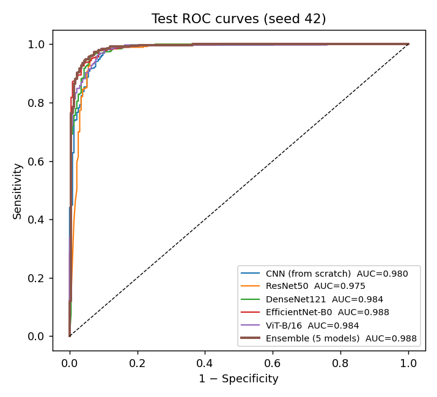
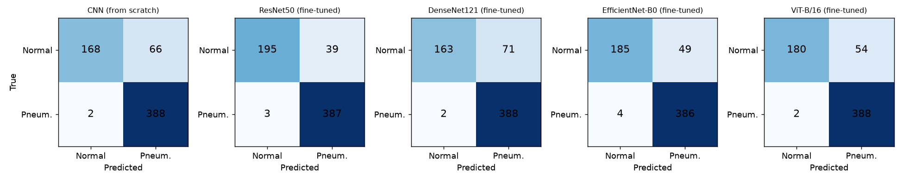
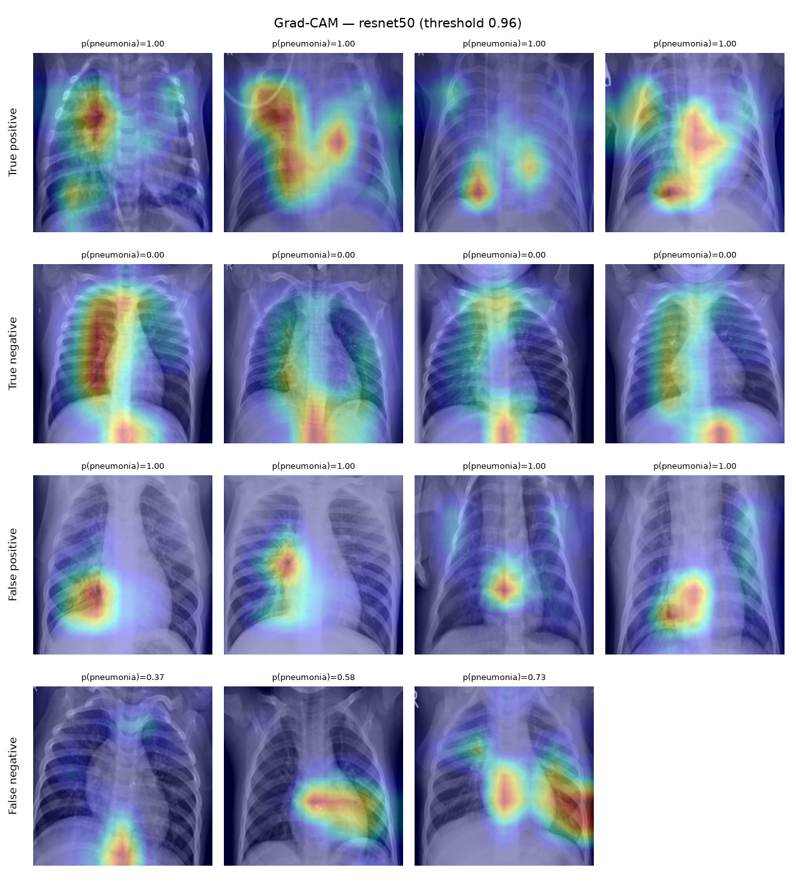
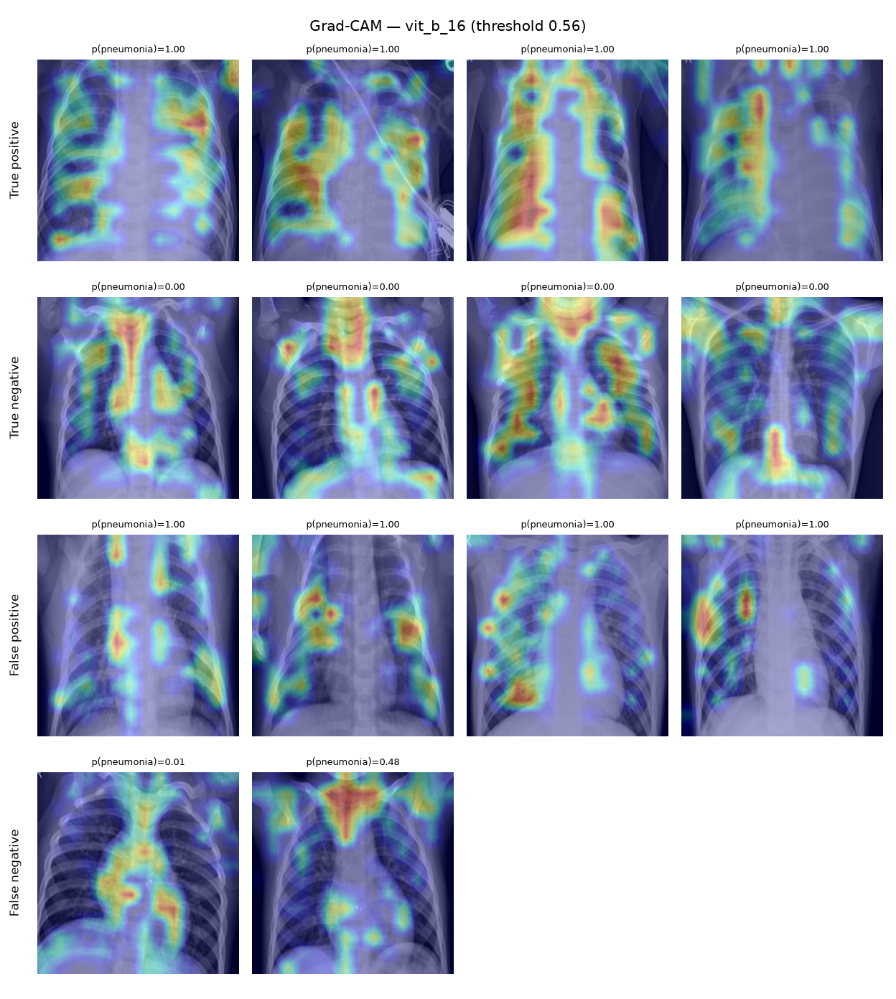

# 胸部 X 光肺炎二分类 (Pneumonia Chest X-Ray Classification)

[](https://github.com/weirdquantum/pneumonia-xray-classification/actions/workflows/tests.yml) [](LICENSE)

基于儿童胸部 X 光片区分 **NORMAL（正常）** 与 **PNEUMONIA（肺炎）**。2025 年暑期科研项目，v2 版本用统一的 PyTorch 流程重写：按患者划分验证集、完整的医学评估指标、ImageNet 预训练模型微调（ResNet50 / DenseNet121 / EfficientNet-B0 / ViT-B/16），并用 Grad-CAM 检查模型是否在"走捷径"。

**最佳结果（ResNet50 微调）：测试集准确率 93.3%，ROC-AUC 0.983，敏感度 99.2%（390 例肺炎漏诊 3 例），特异度 83.3%。** v1 最好成绩为 80.8%。



## 结果

官方测试集 624 张（234 正常 / 390 肺炎），每个模型只在训练结束后评估一次。决策阈值在验证集上用 Youden 指数选取，括号内为按患者重采样的 bootstrap 95% 置信区间。

数值均为百分比（AUC × 100）。

| Model | Params (M) | AUC | Accuracy | Sensitivity | Specificity | F1 | Acc @0.5 | Threshold | CAM border share | Train (min) |
|---|---|---|---|---|---|---|---|---|---|---|
| CNN (from scratch) | 1.2 | 97.6 (96.2–98.6) | 89.1 (86.1–91.7) | 99.5 (98.6–100.0) | 71.8 (65.4–77.7) | 91.9 (89.4–94.1) | 90.4 | 0.41 | 0.28 | 41 |
| ResNet50 (fine-tuned) | 23.5 | 98.3 (97.4–99.0) | 93.3 (91.0–95.2) | 99.2 (98.3–100.0) | 83.3 (78.6–88.0) | 94.9 (92.8–96.4) | 86.4 | 0.96 | 0.21 | 23 |
| DenseNet121 (fine-tuned) | 7.0 | 98.0 (96.7–99.0) | 88.3 (85.4–91.0) | 99.5 (98.7–100.0) | 69.7 (63.5–75.4) | 91.4 (88.9–93.6) | 84.3 | 0.79 | 0.30 | 25 |
| EfficientNet-B0 (fine-tuned) | 4.0 | 98.2 (97.1–99.0) | 91.5 (89.0–93.7) | 99.0 (97.9–99.8) | 79.1 (73.9–84.1) | 93.6 (91.5–95.3) | 88.6 | 0.77 | 0.33 | 13 |
| ViT-B/16 (fine-tuned) | 85.8 | 98.7 (97.9–99.3) | 91.0 (88.6–93.2) | 99.5 (98.6–100.0) | 76.9 (71.2–82.2) | 93.3 (91.1–95.1) | 90.9 | 0.56 | 0.31 | 56 |

- **Acc @0.5**：阈值固定为 0.5 时的准确率，用于对比阈值选择的作用。
- **CAM border share**：Grad-CAM 热力图落在图像外围 12.5% 边框内的比例。热力图均匀分布时为 0.44，越低说明越集中在胸腔。



### 与 v1 对比

| 方法 | v1 准确率 | v2 准确率 |
|---|---|---|
| CNN（从零训练） | 78.0% | 89.1%（训练流程和网络结构都有改动，见下文发现 1） |
| ResNet50 | 80.8%（冻结特征 + 逻辑回归） | 93.3%（微调） |
| ViT | 75.3%（只用了 ViT 预处理器 + 像素逻辑回归） | 91.0%（ViT-B/16 微调） |

## 主要发现

1. **从零训练的 CNN 也从 78.0% 提升到 89.1%，说明 v1 的低分很大程度上不是"模型太小"造成的。** 但 v1 → v2 同时改了很多东西：打乱训练数据、数据增强、类别加权、BatchNorm、输入分辨率（100 → 224）、网络容量（19.7 万 → 120 万参数）和训练轮数（5 → 27），目前还没有消融实验，无法确定各项改动分别贡献了多少。
2. **预训练模型的 AUC 略高，但彼此之间没有显著差异。** 四个预训练模型的测试 AUC 为 0.980–0.987，从零训练的 CNN 为 0.976，置信区间大幅重叠。预训练的主要好处是收敛更快：CNN 训练了 27 轮（41 分钟）才达到最佳，EfficientNet-B0 只用 13 分钟。各模型准确率 88–93% 的差异主要来自阈值，而不是排序能力。
3. **验证集与测试集存在分布偏移。** 验证集 AUC 为 0.997–0.999，测试集只有 0.976–0.987。在验证集上选出的阈值用到测试集上仍然偏宽松：所有模型的敏感度约 99%，特异度只有 70–83%，错误几乎都是"正常片被判为肺炎"。验证集阈值让 ResNet50、DenseNet121、EfficientNet-B0 的准确率比固定 0.5 提高 3–7 个百分点，但对 CNN（90.4% → 89.1%）和 ViT 几乎没有帮助，说明阈值无法完全弥补分布偏移。这说明这个 Kaggle 测试集和训练集来源不完全一致，模型部署到新医院前需要外部验证集重新校准。
4. **没有发现明显的捷径学习。** 所有模型的 Grad-CAM 边框占比（0.21–0.33）都明显低于均匀分布的 0.44。ViT 的热力图分布在双侧肺野，ResNet50 最集中。正常与肺炎图片的原始尺寸存在系统性差异（宽度中位数 1640 px vs 1168 px），因此缓存时统一缩放为正方形，以消除宽高比这一潜在捷径。
5. **所有模型输出的概率都过于自信。** 测试集上 78–85% 的预测小于 0.01 或大于 0.99（ViT 最高，为 85%），而且训练时的类别加权也会让概率整体偏移。在做温度缩放或 Platt 缩放等校准之前，模型输出不能直接当作患病概率使用。

Grad-CAM 示例（每行依次为真阳性、真阴性、假阳性、假阴性中置信度最高的病例）：

| ResNet50 | ViT-B/16 |
|---|---|
|  |  |

## 数据

使用 Kaggle 公开数据集 [Chest X-Ray Images (Pneumonia)](https://www.kaggle.com/datasets/paultimothymooney/chest-xray-pneumonia)（Kermany et al., *Cell* 2018）。数据不在仓库中，下载后把 `train/`、`test/`（以及可选的 `val/`）放在项目根目录。

`scripts/prepare_data.py` 的处理：

- **按患者划分验证集。** 文件名中带有患者编号（`person123_bacteria_456.jpeg`、`IM-0115-0001.jpeg`），训练集 3875 张肺炎片只来自约 1600 名患者，最多一人 30 张。用 `StratifiedGroupKFold` 从训练集中按患者分出 15% 作为验证集，保证同一患者不会同时出现在训练集和验证集，同时保持类别比例。官方 `val/` 只有 16 张，并入训练池。
- **统一读图。** 训练集中有 283 张 JPEG 是 RGB 三通道（v1 的 ViT notebook 正是因此静默丢掉了这些图），这里全部转为灰度后再缩放为 256×256，缓存为 `data/images.npy`。
- **数据检查**（`data/data_report.json`）：训练/验证无患者重叠；数据中有 32 张完全重复的图片，全部在同一划分内部，没有跨划分重复。

| 划分 | 正常 | 肺炎 | 患者数 |
|---|---|---|---|
| train | 1149 | 3321 | 2440 |
| val | 192 | 554 | 406 |
| test | 234 | 390 | 427 |

## 方法

- **输入**：灰度图复制为 3 通道，224×224，ImageNet 均值方差标准化。
- **数据增强**（仅训练）：随机裁剪缩放（面积 70–100%）、±10° 旋转、±5% 平移、亮度/对比度扰动。不使用水平翻转，因为心脏位于左侧，翻转会产生解剖上不合理的图像。
- **类别不平衡**：`BCEWithLogitsLoss` 的 `pos_weight = 正常数 / 肺炎数`；可选 Focal Loss（`--loss focal`）。
- **两阶段微调**：先冻结主干网络的参数，训练 2 轮新分类头（lr 1e-3；注意此阶段 BatchNorm 的统计量仍会随数据更新），再全部解冻，用 AdamW + OneCycle 余弦学习率微调；梯度裁剪 1.0。
- **模型选择**：按验证集 AUC 保存最佳 checkpoint，带早停。测试集只在最后评估一次。由于验证集 AUC 在后期只在小数点后第 4 位波动，所选轮次带有较大随机性。
- **评估**：准确率、敏感度、特异度、精确率、F1、ROC-AUC、混淆矩阵；按患者 bootstrap 1000 次估计置信区间。

## 复现

```bash
python -m venv .venv && source .venv/bin/activate
pip install -e ".[dev]"
```

```bash
bash scripts/run_all.sh
```

`run_all.sh` 依次执行数据缓存、训练全部 5 个模型、生成 Grad-CAM 和汇总结果表。单独训练一个模型：

```bash
python -m pneumonia.train --model resnet50
```

```bash
python -m pneumonia.gradcam --run runs/resnet50
```

自动选择 CUDA / Apple MPS / CPU。在 Apple M5（16 GB）上全部训练约 2.5 小时。运行单元测试：

```bash
pytest
```

## 项目结构

```
src/pneumonia/
  data.py       文件名解析、按患者划分、图像缓存、Dataset 与数据增强
  models.py     模型注册表（simple_cnn / resnet50 / densenet121 / efficientnet_b0 / vit_b_16）
  train.py      两阶段训练、早停、验证集选阈值、测试集评估
  metrics.py    评估指标、Youden 阈值、按患者 bootstrap 置信区间
  gradcam.py    Grad-CAM（含 ViT token 重排）与边框占比检查
scripts/        prepare_data.py、run_all.sh、report.py
runs/<model>/   metrics.json、history.csv、test_predictions.csv、gradcam.json（权重文件未提交）
results/        汇总结果表
figures/        ROC 曲线、混淆矩阵、Grad-CAM 示例
tests/          单元测试
legacy/         v1 的三个 Colab notebook（TensorFlow / sklearn）
```

## 局限与后续工作

- **只有一个测试集，且与训练集存在分布偏移。** 需要在外部数据（如 RSNA Pneumonia、CheXpert）上验证并重新校准阈值。
- **患者编号可能有歧义。** 同一个 `personN` 编号会同时出现在 bacteria 和 virus 两类文件名中，训练集和测试集之间有 170 个编号重复（不同亚型，没有完全相同的图片）。验证集划分时把同编号视为同一患者，是保守做法；官方测试集按原样使用。
- **每个模型只用一个随机种子训练。** 多种子重复实验可以给出更可靠的模型间比较。
- **可以尝试的方向**：医学影像预训练权重（如 TorchXRayVision 的 CheXpert / MIMIC 模型）、概率校准（温度缩放）、细菌性/病毒性肺炎三分类、模型集成。

## 许可证

代码采用 [MIT License](LICENSE)。数据集版权归原作者所有，按其 [CC BY 4.0](https://creativecommons.org/licenses/by/4.0/) 许可使用，本仓库不分发数据。

## 引用

Kermany, D. S., et al. Identifying Medical Diagnoses and Treatable Diseases by Image-Based Deep Learning. *Cell* 172(5), 1122–1131 (2018).
